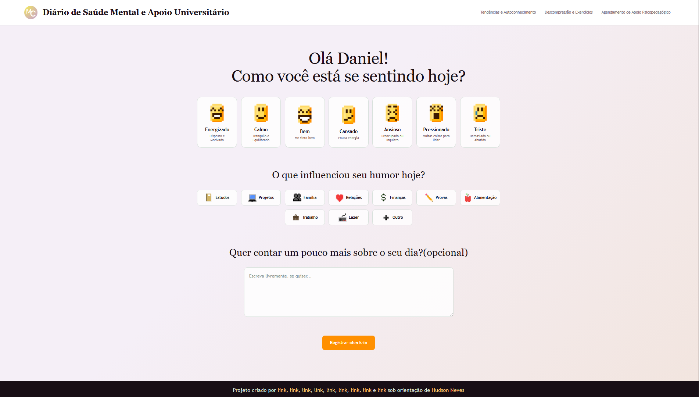
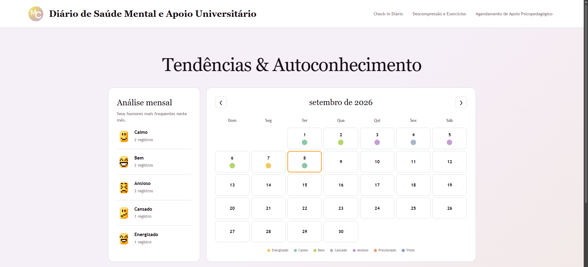
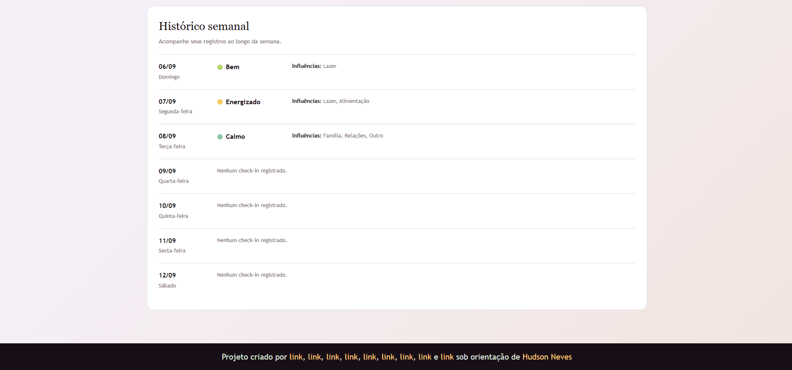

# MindCare - Diário de Saúde Mental e Apoio Universitário

**Tipo:** Health Tech / Bem-Estar / Apoio Estudantil
**Tema:** Acompanhamento de rotina, rastreamento de humor e apoio ao bem-estar no ambiente acadêmico.

---

## 1. Identificação Acadêmica

| Informação                | Dados                                                                      |
| ------------------------- | -------------------------------------------------------------------------- |
| **Instituição de Ensino** | Centro Universitário do Planalto Central Apparecido dos Santos (UNICEPLAC) |
| **Curso**                 | Engenharia de Software                                                     |
| **Disciplina**            | Projeto Integrado de Certificação em Governança e Gestão de TI             |
| **Orientador**            | Prof. Hudson Neves                                                         |
| **Projeto**               | Projeto 05 - MindCare                                                      |

---

## 2. Sobre o Projeto

O **MindCare** é uma aplicação voltada ao acompanhamento do bem-estar de estudantes universitários. O sistema foi desenvolvido com o objetivo de oferecer uma experiência simples e acolhedora para que o estudante possa registrar seu estado emocional, identificar fatores relacionados à sua rotina e acompanhar suas próprias tendências ao longo do tempo.

A aplicação possui como funcionalidade principal o **check-in emocional diário**, no qual o estudante informa como está se sentindo, seleciona fatores que podem ter influenciado seu humor e, opcionalmente, registra uma observação sobre seu dia.

O projeto também contempla uma área de **Tendências e Autoconhecimento**, destinada à visualização do histórico de humor e à identificação de padrões ao longo dos dias e semanas.

Como parte da proposta do sistema, estão previstas ainda áreas de **Descompressão e Exercícios** e **Agendamento de Apoio Psicopedagógico**, que serão desenvolvidas nas próximas etapas do projeto.

> **Observação:** o MindCare é um projeto acadêmico e não tem como objetivo realizar diagnósticos ou substituir acompanhamento profissional especializado.

---

## 3. Objetivos

### Objetivo Geral

Desenvolver uma aplicação web que auxilie estudantes universitários no acompanhamento de seu bem-estar emocional e na percepção de fatores relacionados à sua rotina acadêmica, além de facilitar o acesso aos recursos de apoio disponíveis no ambiente universitário.

### Objetivos Específicos

* Permitir o registro diário do estado emocional do estudante.
* Identificar fatores que podem estar relacionados ao humor do usuário.
* Permitir o acompanhamento do histórico de humor ao longo do tempo.
* Apresentar tendências e informações para auxiliar no autoconhecimento.
* Disponibilizar exercícios de descompressão e respiração.
* Oferecer conteúdos relacionados à organização dos estudos, sono, gestão do tempo e bem-estar.
* Facilitar o acesso ao apoio psicopedagógico disponibilizado pela instituição.
* Desenvolver uma interface simples, acolhedora, responsiva e acessível.
* Aplicar conhecimentos de desenvolvimento Frontend, Backend, banco de dados e integração de sistemas.

---

## 4. Problema

A rotina universitária pode envolver provas, trabalhos, projetos, estudos, compromissos profissionais e questões pessoais que podem influenciar o bem-estar do estudante.

Muitas vezes, o estudante não possui uma forma simples de registrar como está se sentindo ou de observar mudanças em seu próprio estado emocional ao longo do tempo. Além disso, o acesso aos recursos de apoio disponíveis na instituição pode não ser centralizado.

O MindCare busca contribuir para esse cenário por meio de uma aplicação que reúne **registro emocional, acompanhamento de tendências, recursos de descompressão e acesso ao apoio universitário** em um único ambiente.

---

## 5. Público-Alvo

O público-alvo principal do MindCare são **estudantes universitários**, especialmente aqueles que desejam acompanhar melhor sua rotina e seu bem-estar durante a vida acadêmica.

---

## 6. Funcionalidades

### 6.1 Check-in Emocional Diário

Permite que o estudante registre:

* Estado emocional do dia;
* Fatores que influenciaram seu humor;
* Observação opcional sobre o dia;
* Data e horário do registro.

Os estados emocionais disponíveis atualmente são:

* Energizado;
* Calmo;
* Bem;
* Cansado;
* Ansioso;
* Pressionado;
* Triste.

Os fatores disponíveis incluem:

* Estudos;
* Projetos;
* Família;
* Relações;
* Finanças;
* Provas;
* Alimentação;
* Trabalho;
* Lazer;
* Outro.

Atualmente, os registros realizados no frontend são armazenados no **localStorage do navegador**.

---

### 6.2 Tendências e Autoconhecimento

A área de Tendências e Autoconhecimento permite visualizar:

* Histórico de humor;
* Calendário mensal com os registros;
* Humores mais frequentes no mês;
* Histórico semanal;
* Fatores associados aos registros.

Na versão atual do frontend, os registros históricos são obtidos a partir de dados simulados presentes em `mood_logs.json`, enquanto o registro realizado no dia atual pode ser obtido do `localStorage`.

---

### 6.3 Descompressão e Exercícios

Funcionalidade prevista para disponibilizar:

* Exercícios de respiração;
* Orientações visuais;
* Áudios;
* Conteúdos relacionados ao bem-estar;
* Dicas de organização dos estudos;
* Conteúdos sobre sono e gestão do tempo.

**Status:** em desenvolvimento.

---

### 6.4 Agendamento de Apoio Psicopedagógico

Funcionalidade prevista para permitir:

* Visualização dos profissionais disponíveis;
* Consulta de horários;
* Seleção de data e horário;
* Confirmação de agendamento;
* Cancelamento ou reagendamento.

**Status:** em desenvolvimento.

---

## 7. Tecnologias Utilizadas

| Tecnologia       | Utilização                                                                       |
| ---------------- | -------------------------------------------------------------------------------- |
| **HTML5**        | Estrutura das páginas e conteúdo da aplicação                                    |
| **CSS3**         | Estilização, layout, responsividade e identidade visual                          |
| **JavaScript**   | Interações, manipulação do DOM, validações e gerenciamento dos dados no frontend |
| **JSON**         | Armazenamento de dados simulados utilizados durante o desenvolvimento            |
| **LocalStorage** | Armazenamento temporário dos check-ins realizados no navegador                   |
| **Git**          | Controle de versão                                                               |
| **GitHub**       | Hospedagem e gerenciamento do código-fonte                                       |

---

## 8. Frameworks e Bibliotecas

Atualmente, o frontend está sendo desenvolvido utilizando **HTML5, CSS3 e JavaScript puro**, sem a utilização de frameworks.

Bibliotecas e frameworks poderão ser incorporados nas próximas etapas, caso sejam necessários para funcionalidades específicas do projeto.

---

## 9. Arquitetura da Solução

### Arquitetura atual

Durante a etapa de desenvolvimento do frontend, o sistema utiliza uma arquitetura simplificada:

```text
Usuário
   ↓
Interface Web
   ↓
JavaScript
   ├── localStorage
   └── Arquivos JSON simulados
```

O `localStorage` é utilizado para armazenar temporariamente os registros realizados pelo usuário no navegador.

Os arquivos JSON são utilizados como fonte de dados simulados para funcionalidades que ainda serão integradas ao backend.

### Arquitetura prevista

Após a implementação do backend, a arquitetura deverá evoluir para:

```text
Usuário
   ↓
Frontend
   ↓
API
   ↓
Backend
   ↓
Banco de Dados
```

Nessa etapa, o backend será responsável pelo gerenciamento de usuários, autenticação, registros emocionais, agendamentos e demais informações da aplicação.

---

## 10. Modelagem do Banco de Dados

**Status:** ainda não implementado.

Durante a etapa atual, os dados são simulados por meio de arquivos JSON e o registro do dia atual utiliza o `localStorage`.

A modelagem do banco de dados será definida durante a etapa de desenvolvimento do Backend.

### Entidades previstas

Entre as principais entidades previstas estão:

* Usuários;
* Registros de humor;
* Profissionais;
* Agendamentos;
* Recursos.

### Diagrama

O diagrama do banco de dados será adicionado após a conclusão da modelagem.

---

## 11. Dados Simulados

Durante o desenvolvimento do frontend, arquivos JSON são utilizados para simular dados que posteriormente serão gerenciados pelo backend.

### `users.json`

Contém dados fictícios utilizados para representar o usuário da aplicação durante o desenvolvimento do frontend.

Entre os dados estão:

* Identificador;
* Nome;
* Curso;
* Período;
* Idade;
* E-mail.

### `mood_logs.json`

Contém registros fictícios de humor utilizados para demonstrar o histórico e as tendências do estudante.

Os registros possuem informações como:

* Usuário;
* Humor;
* Influências;
* Observação;
* Data;
* Horário.

### `professionals.json`

Será utilizado para armazenar dados simulados dos profissionais disponíveis para atendimento, como nome, especialidade, horários e disponibilidade.

### `resources.json`

Será utilizado para armazenar conteúdos simulados relacionados a exercícios, respiração, organização dos estudos, sono, gestão do tempo e bem-estar.

---

## 12. APIs

As APIs abaixo fazem parte da arquitetura planejada para a etapa de Backend.

| Método | Endpoint                         | Descrição                                         |
| ------ | -------------------------------- | ------------------------------------------------- |
| `POST` | `/api/v1/mood-logs`              | Registrar um novo check-in emocional              |
| `GET`  | `/api/v1/analytics/mood-history` | Consultar histórico e dados para análise de humor |
| `POST` | `/api/v1/appointments`           | Criar um novo agendamento                         |

### Integrações futuras

Entre as integrações que poderão ser implementadas estão:

* Sincronização com Google Calendar;
* Sincronização com Outlook Calendar;
* Notificações;
* Envio de e-mails;
* Integração com WhatsApp;
* Recursos adicionais de segurança e proteção de dados.

---

## 13. Pré-requisitos

Para executar a versão atual do projeto, é necessário:

* Computador ou notebook;
* Navegador atualizado;
* JavaScript habilitado;
* Editor de código, como Visual Studio Code;
* Extensão **Live Server** ou servidor local equivalente.

Não são necessárias dependências externas ou comandos de instalação de pacotes para executar o frontend atual.

---

## 14. Instalação

### 1. Clonar o repositório

```bash
git clone https://github.com/DanielFerreira76/mindcare-diario-de-saude-mental-universitario.git
```

### 2. Acessar a pasta do projeto

```bash
cd mindcare-diario-de-saude-mental-universitario
```

### 3. Abrir o projeto

Abra a pasta do projeto no Visual Studio Code.

### 4. Executar com Live Server

Abra o arquivo `index.html` e execute-o utilizando a extensão **Live Server**.

> O uso de um servidor local é recomendado porque as páginas utilizam `fetch()` para carregar arquivos JSON. A abertura direta dos arquivos HTML pelo sistema de arquivos pode impedir o carregamento desses dados devido às políticas de segurança do navegador.

---

## 15. Como Executar

Após abrir o projeto no Visual Studio Code:

1. Abra o arquivo `index.html`.
2. Clique com o botão direito sobre o arquivo.
3. Selecione **Open with Live Server**.
4. O projeto será aberto no navegador.
5. Acesse a página de Check-in Diário.
6. Realize um check-in para testar o armazenamento local.
7. Acesse a área de Tendências e Autoconhecimento para visualizar os registros disponíveis.

---

## 16. Estrutura do Projeto

A estrutura atual do frontend está organizada da seguinte maneira:

```text
MindCare/
│
├── data/
│   ├── mood_logs.json
│   └── users.json
│
├── img/
│   ├── alimentacao.png
│   ├── ansioso.png
│   ├── bem.png
│   ├── calmo.png
│   ├── cansado.png
│   ├── estudos.png
│   ├── familia.png
│   ├── financas.png
│   ├── lazer.png
│   ├── projetos.png
│   ├── relacoes.png
│   ├── sobrecarregado.png
│   ├── trabalho.png
│   └── triste.png
│
├── pag/
│   ├── tendencias.html
│   ├── tendencias.css
│   └── tendencias.js
│
├── index.html
├── script.js
├── style.css
├── favicon.ico
└── README.md
```

> Arquivos como `professionals.json` e `resources.json`, além das páginas de Descompressão e Agendamento, serão incorporados conforme o desenvolvimento dessas funcionalidades.

---

## 17. Exemplos de Uso

### Exemplo 1 — Check-in Emocional

O estudante acessa a página inicial e responde à pergunta sobre como está se sentindo. Em seguida, seleciona seu humor, escolhe os fatores que influenciaram seu estado emocional e pode adicionar uma observação.

Ao clicar em **"Registrar check-in"**, o sistema verifica se já existe um registro para o dia e, caso não exista, salva o check-in no armazenamento local do navegador.

---

### Exemplo 2 — Tendências e Autoconhecimento

O estudante acessa a área de Tendências e Autoconhecimento para visualizar seus registros de humor.

A página apresenta um calendário mensal, uma análise dos humores mais frequentes e um histórico semanal contendo os registros e as influências informadas.

---

### Exemplo 3 — Apoio Psicopedagógico

Nas próximas etapas do projeto, o estudante poderá acessar a área de apoio psicopedagógico, consultar profissionais e horários disponíveis e realizar um agendamento.

---

## 18. Capturas de Tela

As capturas de tela serão adicionadas conforme as funcionalidades forem concluídas.

### Check-in Diário



### Tendências e Autoconhecimento




### Descompressão e Exercícios

> **[Inserir captura de tela quando a funcionalidade estiver concluída]**

### Agendamento

> **[Inserir captura de tela quando a funcionalidade estiver concluída]**

---

## 19. Equipe do Projeto

| Integrante                      | Função principal                                               |
| ------------------------------- | -------------------------------------------------------------- |
| **Daniel Ferreira Vieira**      | Liderança, Desenvolvimento Frontend e Arquitetura/orientação do projeto |
| **Cleber Júnio da Silva Souza** | Documentação do Frontend |
| **Gabriel Barbosa Luiz**        | Desenvolvimento Backend |
| **Júnio Gomes Pereira**         | QA e testes de responsividade |
| **Arthur Rocha Araújo**         | UI,UX e testes de compatibilidade |
| **João Pedro Alves Soares**     | Desenvolvimento Backend |
| **Daniel Costa Alves da Silva** | Desenvolvimento Backend |
| **Ítalo Rodrigues dos Santos**  | Documentação do Backend |
| **Davi Martins Fagundes**       | Desenvolvimento Backend |

**Orientador:** Prof. Hudson Neves

---

## 20. Divisão de Responsabilidades

### Liderança e Arquitetura

**Daniel Ferreira Vieira**

* Liderança e organização da equipe;
* Desenvolvimento do Frontend;
* Definição da interface e experiência do usuário;
* Organização da arquitetura da aplicação;
* Organização do fluxo de trabalho com Git e GitHub.

### Documentação

**Cleber Júnio da Silva Souza**

* Documentação das funcionalidades do Frontend;
* Organização da documentação relacionada à interface.

**Ítalo Rodrigues dos Santos**

* Documentação relacionada ao Backend;
* Registro das decisões e funcionalidades da parte de servidor.

### Backend

**João Pedro Alves Soares**

* Desenvolvimento de funcionalidades Backend;
* Implementação utilizando Java.

**Gabriel Barbosa Luiz**

* Desenvolvimento Backend;
* Implementação utilizando Java.

**Davi Martins Fagundes**

* Desenvolvimento Backend;
* Implementação utilizando Java.

**Daniel Costa Alves da Silva**

* Desenvolvimento Backend;
* Implementação utilizando Java.

### UI, UX, QA e Testes

**Júnio Gomes Pereira**

* Verificação da interface;
* Testes de responsividade em dispositivos móveis;
* Identificação e registro de problemas encontrados.

**Arthur Rocha Araújo**

* Definição e avaliação da interface e experiência do usuário;
* Testes das funcionalidades;
* Testes de compatibilidade em diferentes navegadores;
* Identificação e registro de problemas encontrados.

---

## 21. Melhorias Futuras

Entre as melhorias previstas para as próximas etapas estão:

* Implementação do Backend;
* Implementação de banco de dados;
* Sistema de cadastro de usuários;
* Sistema de login e autenticação;
* Associação dos registros aos usuários autenticados;
* Persistência dos dados no servidor;
* Implementação completa do Dashboard;
* Implementação dos exercícios de descompressão;
* Implementação do sistema de agendamento;
* Integração com calendário;
* Sistema de notificações;
* Melhorias de segurança e proteção dos dados;
* Deploy completo da aplicação em ambiente de nuvem.

---

## 22. Segurança e Privacidade

Por lidar com informações relacionadas ao bem-estar dos usuários, o MindCare considera a proteção dos dados uma parte importante do desenvolvimento.

Na versão atual do frontend, os dados utilizados são fictícios e os check-ins são armazenados localmente no navegador por meio do `localStorage`.

Na implementação do Backend, deverão ser consideradas medidas adicionais de segurança, incluindo:

* Autenticação de usuários;
* Controle de acesso;
* Proteção das informações pessoais;
* Armazenamento seguro de senhas;
* Criptografia de dados sensíveis;
* Validação das informações recebidas pela API;
* Proteção contra acesso não autorizado.

> O projeto acadêmico não deve ser considerado, em sua versão atual, uma aplicação clínica ou um sistema de atendimento médico.

---

## 23. Status do Projeto

**Status:** Em desenvolvimento

**Versão atual:** 0.1.0 — Frontend

### Funcionalidades em desenvolvimento

* [x] Estrutura inicial do projeto
* [x] Identidade visual
* [x] Página de Check-in Diário
* [x] Seleção de humor
* [x] Seleção de fatores de influência
* [x] Campo de observação
* [x] Validação do check-in
* [x] Armazenamento local do check-in
* [x] Estrutura inicial de dados simulados
* [x] Página de Tendências e Autoconhecimento
* [x] Calendário mensal
* [x] Análise mensal
* [x] Histórico semanal
* [ ] Página de Descompressão e Exercícios
* [ ] Página de Agendamento
* [ ] Backend
* [ ] Banco de Dados
* [ ] Sistema de autenticação
* [ ] Integração Fullstack
* [ ] Deploy da aplicação
* [ ] Testes finais

---

## 24. Licença

Este projeto foi desenvolvido para fins **acadêmicos** no âmbito do curso de Engenharia de Software.

A definição de uma licença específica para distribuição do código será realizada posteriormente pela equipe.

---

## 25. Repositório

O código-fonte do projeto está disponível no GitHub:

**github.com/DanielFerreira76/mindcare-diario-de-saude-mental-universitario**

---

## 26. Observações

O MindCare encontra-se em desenvolvimento e sua arquitetura será evoluída gradualmente durante as etapas do projeto.

A versão atual possui foco no desenvolvimento e validação do **Frontend**, utilizando dados simulados em arquivos JSON e armazenamento local para algumas funcionalidades.

Nas próximas etapas, o projeto será integrado a um Backend, permitindo a persistência centralizada dos dados, autenticação de usuários e implementação das demais funcionalidades previstas na proposta.

**Projeto desenvolvido pela equipe MindCare — Engenharia de Software / UNICEPLAC.**
